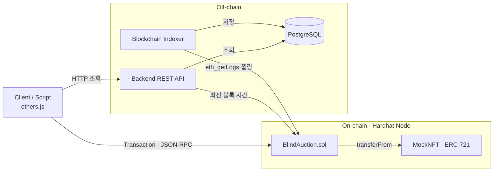
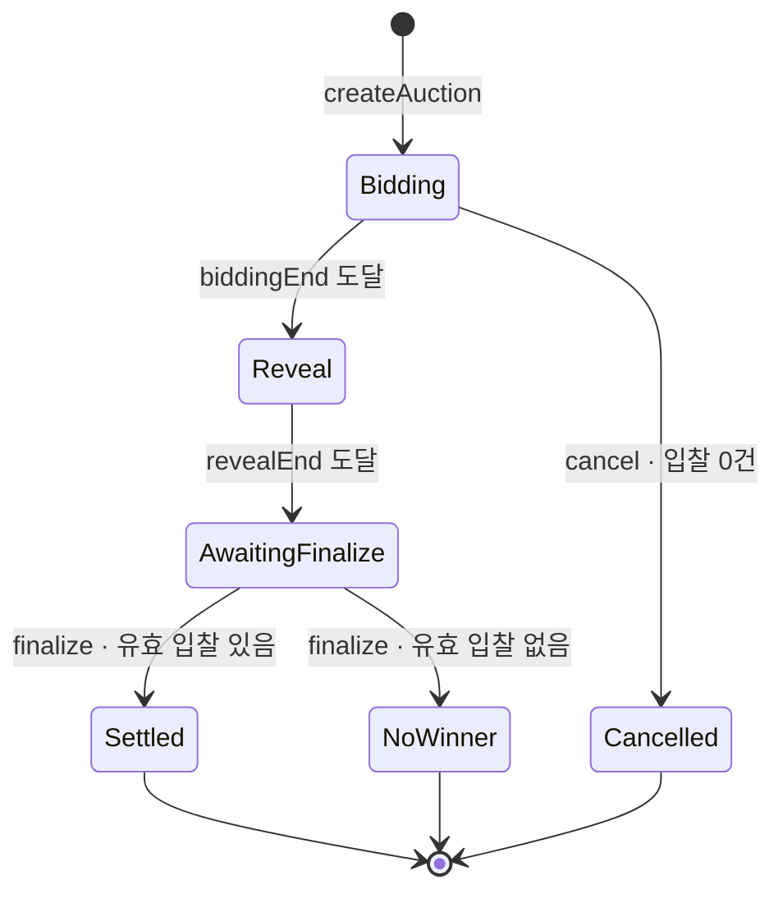

# Blind Auction 설계 문서

> **상태:** 확정 (구현 중 변경 시 이 문서를 먼저 수정)
> **작성일:** 2026-09-29
> **기간:** 2~3주
> **네트워크:** Hardhat 로컬 노드 기준으로 개발·제출 (11장 확정 사항 참고)
> **원본:** Notion "Blind Auction 설계 문서". 이 파일과 Notion 내용이 다르면 이 파일을 기준으로 하고 Notion에 반영한다.

---

## 1. 개요

### 1.1 목표

EVM 기반 블록체인에서 입찰 기간 동안 입찰 금액이 공개되지 않는 Blind Auction 시스템을 만든다. 스마트 컨트랙트가 입찰·검증·낙찰·정산을 처리하고, Indexer가 이벤트를 PostgreSQL에 저장하며, Backend API가 이를 조회용으로 제공한다.

### 1.2 범위

| 포함 | 제외 (이유) |
|---|---|
| Blind Auction 스마트 컨트랙트, 테스트용 ERC-721 컨트랙트 | Frontend (과제 필수 아님) |
| 실행 스크립트 (배포, 경매 생성, 입찰, 공개, 종료, 출금) | 테스트넷 배포 (시간이 남으면 추가) |
| Blockchain Indexer, PostgreSQL, REST API | 블록 재구성(reorg) 처리 (로컬 노드는 발생하지 않음, 6.7에 확장 방안만 기술) |
| 단위 테스트, 통합 테스트, Docker Compose 실행 환경 | 업그레이드 가능한 컨트랙트, 가스 최적화, API 인증 |

### 1.3 기술 스택

| 영역 | 선택 | 이유 |
|---|---|---|
| Smart Contract | Solidity 0.8.x, OpenZeppelin | 과제 지정. 0.8부터 정수 오버플로 자동 검사, OpenZeppelin으로 ERC-721·ReentrancyGuard 검증된 구현 사용 |
| 개발·테스트 | Hardhat (TypeScript), Mocha/Chai, hardhat-network-helpers | 과제 지정. 로컬 노드와 시간 이동(`time.increaseTo`) 제공 |
| Blockchain Library | ethers.js v6 | 과제 지정. Indexer·API·스크립트에서 공통 사용 |
| Backend | TypeScript, Express | Framework 자유. 기존 Express 경험 활용, 구조가 단순함 |
| Database | PostgreSQL, node-postgres(`pg`), SQL 마이그레이션 | 과제 지정. Indexer의 트랜잭션·`ON CONFLICT` 처리를 SQL로 명확하게 제어 |
| 통합 테스트 | Vitest, Supertest | TypeScript 설정 없이 바로 사용 가능, API 테스트 지원 |
| 실행 환경 | Docker Compose | Hardhat 노드, PostgreSQL, Indexer, API를 명령 하나로 실행 |
| 소스 관리 | GitHub (브랜치 + Pull Request) | 작업 단위와 변경 이력을 추적 가능하게 관리 (1.6) |
| 네트워크 | Hardhat 로컬 노드 | 평가자가 `docker compose up`만으로 실행·검증 가능, 테스트넷 ETH·RPC 키 불필요, 시간 이동으로 입찰·공개 단계를 즉시 테스트. Indexer는 `CONFIRMATIONS`·블록 해시 검증으로 테스트넷 확장이 가능한 구조 (6.7) |

### 1.4 시스템 아키텍처



- 과제 문서의 다이어그램에서 보완한 점: Client → API 조회 경로 추가, Indexer가 노드에 RPC로 이벤트를 **가져오는** 방향으로 표시

### 1.5 저장소 구조

```text
blind-auction/
├─ contracts/          # Hardhat 프로젝트
│  ├─ contracts/       # BlindAuction.sol, MockNFT.sol
│  ├─ scripts/         # 배포·경매 실행 스크립트
│  └─ test/            # 컨트랙트 단위 테스트
├─ indexer/            # Blockchain Indexer
├─ api/                # Backend REST API
├─ db/migrations/      # SQL 마이그레이션
├─ tests/integration/  # 통합 테스트
├─ docs/design.md      # 이 문서
├─ docker-compose.yml
└─ README.md
```

### 1.6 소스 코드 관리

- **저장소:** GitHub
- **브랜치:** `main`은 항상 실행 가능한 상태로 유지한다. 작업은 단계별 브랜치에서 한다.
  - `chore/setup`, `feat/contract`, `feat/scripts`, `feat/indexer`, `feat/api`, `test/integration`, `docs/readme`
- **이슈:** 단계마다 GitHub Issue를 만들고 할 일을 체크리스트로 적는다.
- **Pull Request:** 단계가 끝나면 PR로 `main`에 병합한다. PR 본문에는 변경 내용, 테스트 결과, 설계 문서와 달라진 점을 적고 `Closes #이슈번호`로 이슈와 연결한다.
- **커밋:** 기능 하나가 테스트를 통과할 때마다 작게 커밋한다. 메시지는 Conventional Commits 형식을 따른다.
  - 예: `feat(contract): 입찰(commit) 기능 추가`, `test(contract): 동점 처리 테스트 추가`, `fix(indexer): 재시작 시 마지막 블록 중복 처리 수정`, `docs: README 장애 복구 절차 추가`
  - 타입: `feat`, `fix`, `test`, `refactor`, `docs`, `chore`
- **커밋 금지:** `.env`, `.bids/`, `node_modules/`, 빌드 산출물 (`.gitignore`로 관리)

### 1.7 README 구성

평가 항목과 1:1로 대응하도록 구성한다.

| README 섹션 | 내용 | 근거 |
|---|---|---|
| 프로젝트 소개 | 한 줄 요약, 아키텍처 다이어그램 | 1.4 |
| 빠른 시작 | 요구 환경, `docker compose up`, 시나리오 실행 | 7.5 |
| 설계 방식과 이유 | 경매 규칙과 설계 결정 요약표 | 2장, 2.7 |
| 구성 요소와 연동 | 컨트랙트 → 이벤트 → Indexer → DB → API 흐름 | 4~7장 |
| 테스트 | 실행 명령, 테스트 범위, 커버리지 결과 | 9장 |
| 장애 발생 시 복구 | 장애 상황별 감지·복구 방법 표 | 6.9, 6.10 |
| 보안 | 요구사항별 대응, 알려진 한계 | 8장 |
| 개발 과정 | 브랜치·PR 운영 방식, AI 코딩 도구 사용 사실 | 1.6 |

---

## 2. 경매 규칙

> **한 줄 요약:** NFT를 걸고 ETH로 입찰한다. 입찰 단계에는 해시만 제출하고, 공개 단계에 금액을 밝혀 검증한다. 최고가 입찰자가 자신의 입찰가를 내고 NFT를 받는다. 모든 ETH는 각자 직접 출금한다.

### 2.1 경매 대상과 결제 자산

- **경매 대상:** ERC-721 NFT 1개. 경매 생성 시 컨트랙트로 이동해 보관(에스크로)한다.
- **결제 자산:** ETH
- 과제 답변상 대상 형태는 자유이며, 정산 과정 전체(대상 전달, 대금 지급, 유찰 시 반환)를 온체인에서 보장할 수 있는 NFT를 선택했다.

### 2.2 비공개 입찰 방식: Commit-Reveal

**입찰 단계**에는 아래 해시(commitment)와 보증금(ETH)만 제출한다.

```solidity
commitment = keccak256(abi.encode(
    address(this),  // 다른 배포 컨트랙트에서 재사용 방지
    auctionId,      // 다른 경매에서 재사용 방지
    bidder,         // 다른 사람의 해시 복사 방지
    value,          // 실제 입찰 금액 (wei)
    fake,           // 가짜 입찰 여부
    salt            // 32바이트 난수
));
```

**공개 단계**에 `value`, `fake`, `salt`를 제출하면 컨트랙트가 같은 해시를 계산해 일치하는지 검증한다.

**보증금 노출 문제와 대응**

- 입찰 시 보내는 ETH 금액(보증금)은 누구나 볼 수 있어, 보증금 = 입찰가라면 비공개가 깨진다.
- 대응 1: **초과 보증금 허용.** 보증금은 입찰가 이상이면 되고, 차액은 공개 후 돌려받는다.
- 대응 2: **가짜 입찰 허용.** `fake = true`로 제출한 입찰은 낙찰 대상에서 빠지고 보증금은 전액 돌려받는다.
- 결과: 다른 참여자는 "이 사람의 입찰가는 보증금 이하"라는 상한만 알 수 있고, 몇 건이 진짜인지도 알 수 없다.

### 2.3 유효·무효 입찰 기준

| 경우 | 판정 | 보증금 처리 |
|---|---|---|
| 공개 기간 내 공개하지 않음 | 무효 | **몰수** → 판매자에게 지급 |
| 해시 불일치 | 공개 실패 (트랜잭션 revert) | 공개 기간 내 올바른 값으로 다시 시도 가능. 끝까지 실패하면 미공개와 동일 |
| `fake = true` | 무효 | 전액 반환 |
| 보증금 < 입찰가 | 무효 | 전액 반환 |
| 입찰가 < 최저가 또는 입찰가 = 0 | 무효 | 전액 반환 |
| 위 조건 모두 통과 | **유효** | 낙찰되면 입찰가를 제외한 차액 반환, 낙찰되지 않으면 전액 반환 |

### 2.4 낙찰 규칙

- **1가 경매:** 유효 입찰 중 가장 높은 금액을 쓴 입찰자가 그 금액을 지불한다.
- **동점:** 먼저 **제출(commit)**된 입찰이 낙찰된다. 제출 순서는 전역 순번(`seq`)으로 기록한다.
- **최고가 갱신 방식:** 공개될 때마다 현재 최고가와 비교해 즉시 갱신한다. 최고가에서 밀려난 입찰의 금액은 그 입찰자의 출금 가능 금액에 적립한다. 따라서 종료 시 입찰 전체를 다시 순회할 필요가 없다.

### 2.5 참여 제한

- 판매자는 자신의 경매에 입찰할 수 없다.
- 한 주소가 같은 경매에 여러 번 입찰할 수 있다. (가짜 입찰을 섞기 위해 필요)
- 입찰 단계이고 입찰이 0건일 때만 판매자가 경매를 취소할 수 있다.

### 2.6 정산

| 대상 | 받는 것 | 시점 |
|---|---|---|
| 낙찰자 | NFT + 낙찰 입찰의 (보증금 − 입찰가) + 다른 입찰의 반환금 | NFT: `finalize` 시 전달. ETH: 공개 시 적립 → `withdraw`로 출금 |
| 판매자 (낙찰) | 낙찰가 + 몰수된 보증금 | `finalize` 시 적립 → `withdraw` |
| 판매자 (유찰) | NFT 반환 + 몰수된 보증금 | `finalize` 시 |
| 떨어진 입찰자 | 공개한 입찰의 보증금 전액 | 공개 시 적립 (최고가에서 밀려나면 그때 적립) → `withdraw` |
| 공개하지 않은 입찰자 | 없음 (해당 입찰 보증금 몰수) | - |

**정산 예시 (최저가 1 ETH)**

1. 입찰 단계: A는 3 ETH 입찰에 보증금 5 ETH. B는 가짜 입찰(보증금 2 ETH)과 4 ETH 입찰(보증금 4 ETH). C는 2 ETH 입찰에 보증금 2 ETH.
2. A 공개 → 최고가 A 3 ETH, A에게 2 ETH 적립
3. B 가짜 입찰 공개 → B에게 2 ETH 적립
4. B 4 ETH 입찰 공개 → 최고가 B 4 ETH, A에게 3 ETH 추가 적립, B 적립 0
5. C는 공개하지 않음 → 2 ETH 몰수
6. `finalize` → NFT는 B에게, 판매자에게 4 + 2 = 6 ETH 적립
7. 최종 출금: A 5 ETH, B 2 ETH, 판매자 6 ETH. 합계 13 ETH = 입금된 보증금 합계 13 ETH

### 2.7 설계 결정 요약

| 항목 | 결정 | 이유 | 검토한 대안 |
|---|---|---|---|
| 경매 대상 | ERC-721 NFT | 대상 전달까지 온체인에서 보장 | 등록 정보 (정산이 금액만 남음), 실물 (전달 보장 불가) |
| 결제 자산 | ETH | approve 절차가 없어 흐름이 단순. 금액 노출 문제는 ERC-20도 동일 | ERC-20 |
| 비공개 방식 | Commit-Reveal | 추가 인프라 없이 EVM만으로 구현 가능한 표준 방식 | 암호화 입찰 (키 관리 주체 필요), 영지식 증명 (과제 범위 초과) |
| 보증금 노출 대응 | 초과 보증금 + 가짜 입찰 | 보증금으로 입찰가를 특정할 수 없게 함 | 공개 단계에 결제 (낙찰자가 결제하지 않을 위험) |
| 가격 방식 | 1가 | 공개 즉시 최고가 갱신만 하면 되어 구현·검증이 단순 | 2가 (2등 금액 추적 필요) |
| 동점 처리 | 먼저 제출된 입찰 | 제출 순서는 입찰 단계에 이미 확정되어 공개 순서 경쟁(가스비 경쟁)이 생기지 않음 | 먼저 공개된 입찰 |
| 미공개 입찰 | 보증금 몰수 → 판매자 | 공개 단계에서 현재 최고가를 보고 유리한 입찰만 골라 공개하는 전략을 막음 | 전액 반환 (선택적 공개 허용) |
| 단계 전환 | 시간 기준 자동 (`block.timestamp`) | 판매자나 관리자가 개입할 필요가 없고 조작 여지가 없음 | 판매자가 수동 전환 |
| 종료 호출자 | 누구나 | 판매자가 호출하지 않아도 자산이 묶이지 않음 | 판매자만 |
| ETH 지급 | Pull 방식 (`withdraw`) | 한 사람의 송금 실패가 경매 전체를 멈추지 않음, 재진입 위험 감소 | Push 방식 (종료 시 일괄 송금) |
| NFT 전송 | `transferFrom` | 수신 콜백이 없어 재진입과 수신 거부로 인한 종료 실패를 막음 | `safeTransferFrom` |
| 컨트랙트 구조 | 단일 컨트랙트 + `auctionId` | Indexer가 주소 하나만 감시하면 됨 | 경매마다 컨트랙트 생성 (Factory) |
| 취소 | 입찰 0건일 때만 | 입찰자가 보증금을 넣은 뒤 판매자 마음대로 취소하는 것을 막음 | 언제든 취소, 취소 불가 |

---

## 3. 경매 상태 흐름

### 3.1 상태 정의

상태는 저장하지 않고 시간과 플래그로 **계산**한다. (`phaseOf(auctionId)`)

| 상태 | 조건 | 의미 |
|---|---|---|
| `Bidding` | now < biddingEnd | 입찰 단계 |
| `Reveal` | biddingEnd ≤ now < revealEnd | 입찰 확인(공개) 단계 |
| `AwaitingFinalize` | revealEnd ≤ now, 미확정 | 공개 종료, `finalize` 대기 |
| `Settled` | finalized, 낙찰자 있음 | 낙찰 종료 |
| `NoWinner` | finalized, 낙찰자 없음 | 유찰 종료 |
| `Cancelled` | cancelled | 취소 |

### 3.2 상태 전이



### 3.3 상태별 호출 가능 함수

| 함수 | Bidding | Reveal | AwaitingFinalize | Settled · NoWinner · Cancelled |
|---|---|---|---|---|
| `bid` | ✅ | ❌ | ❌ | ❌ |
| `cancel` | ✅ (입찰 0건) | ❌ | ❌ | ❌ |
| `reveal` | ❌ | ✅ | ❌ | ❌ |
| `finalize` | ❌ | ❌ | ✅ | ❌ |
| `withdraw` | 상태와 무관 (적립 금액이 있으면 언제든) | | | |

---

## 4. 스마트 컨트랙트 설계

### 4.1 구조

- `BlindAuction.sol`: 하나의 컨트랙트가 여러 경매를 `auctionId`로 관리한다.
- `MockNFT.sol`: 테스트·시연용 ERC-721 (OpenZeppelin 상속, `mint` 함수만 추가)
- 상속: `ReentrancyGuard` (OpenZeppelin)

### 4.2 저장 데이터

```solidity
struct Auction {
    address seller;
    address nft;
    uint256 tokenId;
    uint256 reservePrice;      // 최저가 (wei)
    uint64  biddingEnd;
    uint64  revealEnd;
    address highestBidder;     // 현재 최고가 입찰자 (없으면 0)
    uint256 highestBid;
    uint256 highestBidSeq;     // 동점 처리용: 최고가 입찰의 제출 순번
    uint256 totalDeposits;     // 모든 입찰 보증금 합계
    uint256 revealedDeposits;  // 공개된 입찰 보증금 합계
    uint32  bidCount;
    bool    finalized;
    bool    cancelled;
}

struct Bid {
    bytes32 commitment;
    uint256 deposit;
    uint256 seq;               // 전역 제출 순번
    bool    revealed;
}

uint256 public nextAuctionId;
uint256 private bidSeq;
mapping(uint256 => Auction) private auctions;
mapping(uint256 => mapping(address => Bid[])) private bids;
mapping(address => uint256) public pendingWithdrawals;
```

- **몰수액 계산:** `totalDeposits - revealedDeposits`. 입찰 목록을 순회하지 않고 O(1)로 계산한다.

### 4.3 함수 명세

| 함수 | 호출자 | 조건 | 동작 |
|---|---|---|---|
| `createAuction(nft, tokenId, reservePrice, biddingDuration, revealDuration)` | NFT 소유자 | 각 기간 1분~30일, 컨트랙트에 NFT approve 완료 | NFT를 컨트랙트로 이동, `auctionId` 발급, `AuctionCreated` |
| `bid(auctionId, commitment)` payable | 판매자 제외 누구나 | `Bidding`, 보증금 0 초과 | Bid 추가, `totalDeposits` 증가, `BidCommitted` |
| `reveal(auctionId, bidIndex, value, fake, salt)` | 해당 입찰자 본인 | `Reveal`, 미공개, 해시 일치 | 유효성 판정, 최고가 갱신, 반환금 적립, `BidRevealed` (최고가 변경 시 `HighestBidUpdated`) |
| `finalize(auctionId)` | 누구나 | `AwaitingFinalize` | 확정 처리, NFT 전달(낙찰자 또는 판매자), 판매자에게 낙찰가 + 몰수액 적립, `AuctionFinalized` |
| `cancel(auctionId)` | 판매자 | `Bidding`, 입찰 0건 | NFT를 판매자에게 반환, `AuctionCancelled` |
| `withdraw()` | 누구나 | 적립 금액 0 초과 | 적립 금액을 0으로 만든 뒤 ETH 송금, `Withdrawn` |

**reveal 처리 순서 (의사 코드)**

```text
check  phaseOf(auctionId) == Reveal
b = bids[auctionId][msg.sender][bidIndex]      // 없으면 BidNotFound
check  !b.revealed                              // AlreadyRevealed
check  hash(this, auctionId, msg.sender, value, fake, salt) == b.commitment

b.revealed = true
a.revealedDeposits += b.deposit
refund = b.deposit

reason = fake                 ? Fake
       : b.deposit < value    ? InsufficientDeposit
       : value == 0 || value < a.reservePrice ? BelowReserve
       : None

if reason == None and (value > a.highestBid
                       or (value == a.highestBid and b.seq < a.highestBidSeq)):
    if a.highestBidder != 0:
        pendingWithdrawals[a.highestBidder] += a.highestBid   // 밀려난 입찰 금액 반환
    a.highestBidder = msg.sender
    a.highestBid = value
    a.highestBidSeq = b.seq
    refund -= value
    emit HighestBidUpdated

pendingWithdrawals[msg.sender] += refund
emit BidRevealed(..., reason, refund)
```

### 4.4 조회 함수 (view)

- `getAuction(auctionId)`: Auction 전체 필드
- `phaseOf(auctionId)`: 3.1의 상태
- `getBid(auctionId, bidder, bidIndex)`, `bidCountOf(auctionId, bidder)`
- `pendingWithdrawals(address)`: 출금 가능 금액
- 용도: 스크립트에서 상태 확인, Indexer 정합성 검증(6.6)

### 4.5 이벤트

Indexer가 **추가 조회 없이** DB를 채울 수 있도록 필요한 값을 모두 담는다. 검색에 쓰는 값은 `indexed`로 지정한다.

```solidity
enum InvalidReason { None, Fake, InsufficientDeposit, BelowReserve }

event AuctionCreated(
    uint256 indexed auctionId, address indexed seller, address indexed nft,
    uint256 tokenId, uint256 reservePrice, uint64 biddingEnd, uint64 revealEnd
);
event BidCommitted(
    uint256 indexed auctionId, address indexed bidder,
    uint256 bidIndex, uint256 seq, bytes32 commitment, uint256 deposit
);
event BidRevealed(
    uint256 indexed auctionId, address indexed bidder,
    uint256 bidIndex, uint256 value, bool fake, InvalidReason reason, uint256 refund
);
event HighestBidUpdated(uint256 indexed auctionId, address indexed bidder, uint256 amount);
event AuctionFinalized(
    uint256 indexed auctionId, address indexed winner, uint256 winningBid, uint256 forfeited
);  // 유찰이면 winner = address(0), winningBid = 0
event AuctionCancelled(uint256 indexed auctionId);
event Withdrawn(address indexed account, uint256 amount);
```

### 4.6 에러

```solidity
error AuctionNotFound();
error InvalidDuration();
error InvalidPhase();
error NotSeller();
error SellerCannotBid();
error ZeroDeposit();
error BidNotFound();
error AlreadyRevealed();
error CommitmentMismatch();
error AuctionHasBids();
error NothingToWithdraw();
error TransferFailed();
```

- `require` 문자열 대신 custom error 사용: 가스 절약, 테스트에서 `revertedWithCustomError`로 정확히 검증 가능

---

## 5. 데이터 설계

### 5.1 온체인 · 오프체인 구분

| 위치 | 데이터 | 역할 |
|---|---|---|
| 블록체인 (원본) | 경매 정보, 입찰 해시·보증금, 공개 결과, 최고가, 출금 가능 금액, NFT 소유권 | 자산 처리와 규칙 판정의 기준. **모든 판단은 온체인 데이터로만** 한다. |
| PostgreSQL (사본) | 이벤트 원본 로그, 경매·입찰·출금 조회용 테이블, Indexer 진행 상태 | 목록·필터·사용자별 조회. 언제든 블록체인에서 다시 만들 수 있다. |
| 사용자 로컬 (Client) | salt, 입찰 원문 (금액, 가짜 여부) | 공개 단계 전까지 본인만 보관 |

### 5.2 공개 범위

| 데이터 | 입찰 단계 | 공개 단계 | 종료 후 |
|---|---|---|---|
| 경매 정보 (판매자, NFT, 최저가, 기간) | 공개 | 공개 | 공개 |
| 입찰자 주소, 입찰 건수, 보증금, commitment | 공개 (금액은 알 수 없음) | 공개 | 공개 |
| 실제 입찰가, 가짜 여부, salt | **비공개** | 공개한 입찰만 공개 | 공개하지 않은 입찰은 끝까지 비공개 |
| 현재 최고가·최고가 입찰자 | 없음 | 공개 (실시간 갱신) | 확정 |

### 5.3 salt 관리

- salt는 스크립트가 `crypto.randomBytes(32)`로 생성한다. 금액 범위가 좁아 salt가 약하면 해시를 무차별 대입으로 풀 수 있기 때문이다.
- 입찰 원문과 salt는 로컬 파일 `.bids/{chainId}-{auctionId}-{address}.json`에 저장하고 `.gitignore`에 추가한다.
- **서버와 DB에는 salt를 저장하지 않는다.** 서버가 보관하면 서버 관리자가 입찰가를 알 수 있어 비공개가 깨진다.

### 5.4 DB 스키마

- uint256 값은 `NUMERIC(78,0)`, 주소는 소문자 `CHAR(42)`, 해시는 `CHAR(66)`으로 저장한다.

```sql
-- 이벤트 원본 (중복 방지의 기준)
CREATE TABLE chain_events (
  id            BIGSERIAL PRIMARY KEY,
  block_number  BIGINT       NOT NULL,
  block_hash    CHAR(66)     NOT NULL,
  tx_hash       CHAR(66)     NOT NULL,
  log_index     INTEGER      NOT NULL,
  event_name    TEXT         NOT NULL,
  args          JSONB        NOT NULL,
  created_at    TIMESTAMPTZ  NOT NULL DEFAULT now(),
  UNIQUE (tx_hash, log_index)
);

-- Indexer 진행 상태
CREATE TABLE indexer_state (
  contract_address  CHAR(42)     PRIMARY KEY,
  chain_id          BIGINT       NOT NULL,
  genesis_hash      CHAR(66)     NOT NULL,   -- 체인 초기화 감지용 (6.9)
  last_block        BIGINT       NOT NULL,
  last_block_hash   CHAR(66),
  updated_at        TIMESTAMPTZ  NOT NULL DEFAULT now()
);

-- 경매
CREATE TABLE auctions (
  auction_id      NUMERIC(78,0) PRIMARY KEY,
  seller          CHAR(42)      NOT NULL,
  nft_address     CHAR(42)      NOT NULL,
  token_id        NUMERIC(78,0) NOT NULL,
  reserve_price   NUMERIC(78,0) NOT NULL,
  bidding_end     TIMESTAMPTZ   NOT NULL,
  reveal_end      TIMESTAMPTZ   NOT NULL,
  bid_count       INTEGER       NOT NULL DEFAULT 0,
  highest_bidder  CHAR(42),
  highest_bid     NUMERIC(78,0),
  cancelled       BOOLEAN       NOT NULL DEFAULT FALSE,
  finalized       BOOLEAN       NOT NULL DEFAULT FALSE,
  winner          CHAR(42),
  winning_bid     NUMERIC(78,0),
  forfeited       NUMERIC(78,0),
  created_block   BIGINT        NOT NULL,
  created_tx      CHAR(66)      NOT NULL,
  updated_block   BIGINT        NOT NULL
);
CREATE INDEX idx_auctions_seller ON auctions (seller);
CREATE INDEX idx_auctions_time   ON auctions (bidding_end, reveal_end);

-- 입찰
CREATE TABLE bids (
  auction_id       NUMERIC(78,0) NOT NULL REFERENCES auctions(auction_id),
  bidder           CHAR(42)      NOT NULL,
  bid_index        INTEGER       NOT NULL,
  seq              NUMERIC(78,0) NOT NULL,
  commitment       CHAR(66)      NOT NULL,
  deposit          NUMERIC(78,0) NOT NULL,
  committed_block  BIGINT        NOT NULL,
  committed_tx     CHAR(66)      NOT NULL,
  revealed         BOOLEAN       NOT NULL DEFAULT FALSE,
  value            NUMERIC(78,0),
  fake             BOOLEAN,
  invalid_reason   SMALLINT,     -- 0 유효, 1 가짜, 2 보증금 부족, 3 최저가 미만
  refund           NUMERIC(78,0),
  revealed_block   BIGINT,
  revealed_tx      CHAR(66),
  PRIMARY KEY (auction_id, bidder, bid_index)
);
CREATE INDEX idx_bids_bidder ON bids (bidder);

-- 출금
CREATE TABLE withdrawals (
  tx_hash       CHAR(66)      NOT NULL,
  log_index     INTEGER       NOT NULL,
  account       CHAR(42)      NOT NULL,
  amount        NUMERIC(78,0) NOT NULL,
  block_number  BIGINT        NOT NULL,
  PRIMARY KEY (tx_hash, log_index)
);
CREATE INDEX idx_withdrawals_account ON withdrawals (account);
```

---

## 6. Blockchain Indexer 설계

### 6.1 처리 흐름

1. 시작 시 `indexer_state.last_block`을 읽는다. 없으면 `DEPLOY_BLOCK - 1`부터 시작한다.
2. `head = eth_blockNumber`, `target = head - CONFIRMATIONS`
3. `from = last_block + 1`, `to = min(from + BATCH_SIZE - 1, target)`. `from`이 `target`보다 크면 `POLL_INTERVAL_MS`만큼 대기 후 2로.
4. `eth_getLogs(address, from, to)`로 로그를 가져와 (블록 번호, logIndex) 순으로 정렬하고 ABI로 디코딩한다.
5. **DB 트랜잭션 하나** 안에서
   1. `chain_events`에 `INSERT ... ON CONFLICT (tx_hash, log_index) DO NOTHING`
   2. **새로 삽입된 이벤트만** 조회용 테이블에 반영 (6.2)
   3. `indexer_state.last_block = to`로 갱신
6. COMMIT 후 3으로 돌아간다. 따라잡는 중이면 대기 없이 바로 다음 범위를 처리한다.

### 6.2 이벤트별 DB 반영 규칙

| 이벤트 | DB 반영 |
|---|---|
| `AuctionCreated` | `auctions` INSERT |
| `BidCommitted` | `bids` INSERT, `auctions.bid_count + 1` |
| `BidRevealed` | `bids` UPDATE (revealed, value, fake, invalid_reason, refund) |
| `HighestBidUpdated` | `auctions` UPDATE (highest_bidder, highest_bid) |
| `AuctionFinalized` | `auctions` UPDATE (finalized, winner, winning_bid, forfeited) |
| `AuctionCancelled` | `auctions.cancelled = true` |
| `Withdrawn` | `withdrawals` INSERT |

### 6.3 중복 처리 방지

- 이벤트는 `(tx_hash, log_index)`로 유일하게 식별된다. `chain_events`의 UNIQUE 제약으로 같은 이벤트는 한 번만 저장된다.
- 조회용 테이블 반영은 **INSERT에 성공한 이벤트에만** 수행한다. 같은 범위를 다시 처리해도 `bid_count + 1` 같은 누적 연산이 두 번 실행되지 않는다.
- 이벤트 저장, 테이블 반영, `last_block` 갱신이 한 트랜잭션이므로 중간에 죽어도 "저장은 됐는데 반영은 안 된" 상태가 생기지 않는다.

### 6.4 중단 후 복구

- `last_block`은 트랜잭션 COMMIT과 함께만 전진한다. 재시작하면 마지막으로 **완료된** 블록 다음부터 이어서 수집한다.
- 중단된 동안 쌓인 블록은 6.1의 3단계에서 `BATCH_SIZE` 단위로 빠르게 따라잡는다.

### 6.5 오류 처리

- RPC·DB 오류: 트랜잭션 롤백 후 지수 백오프(1초, 2초, 4초 … 최대 30초)로 같은 범위를 재시도한다.
- 로그가 너무 많아 RPC가 거부하면 `BATCH_SIZE`를 절반으로 줄여 재시도한다.
- 종료 신호(SIGTERM)를 받으면 현재 배치를 마친 뒤 종료한다.

### 6.6 정합성 검증과 재동기화

- **원칙:** 블록체인이 원본이고, DB는 언제든 다시 만들 수 있는 사본이다.
- **검증** (`npm run indexer:verify`): DB의 경매마다 컨트랙트 `getAuction()` 결과와 `bid_count`, `highest_bid`, `finalized`, `cancelled`, `winner`를 비교하고 불일치 목록을 출력한다. Indexer 실행 중에도 일정 주기로 미확정 경매만 자동 검증한다.
- **재동기화** (`npm run indexer:resync`): 조회용 테이블과 `chain_events`를 비우고 `last_block`을 배포 블록으로 되돌려 처음부터 다시 수집한다. 결과는 항상 같다 (결정적).

### 6.7 블록 재구성 (reorg)

- Hardhat 로컬 노드는 트랜잭션마다 즉시 블록을 만들고 재구성이 없으므로 `CONFIRMATIONS = 0`으로 둔다.
- 테스트넷 확장 시
  - `CONFIRMATIONS`를 12 정도로 설정해 확정된 블록만 처리한다.
  - `last_block_hash`를 저장하고, 다음 배치 전 해당 블록의 해시가 그대로인지 확인한다. 다르면 N블록을 되돌려(`chain_events`와 조회용 테이블 롤백) 다시 처리한다.

### 6.8 설정값

| 이름 | 기본값 | 설명 |
|---|---|---|
| `RPC_URL` | `http://localhost:8545` | 블록체인 노드 주소 |
| `CONTRACT_ADDRESS` | - | BlindAuction 배포 주소 |
| `DEPLOY_BLOCK` | - | 배포된 블록 (수집 시작점) |
| `BATCH_SIZE` | 1000 | 한 번에 조회할 블록 수 |
| `POLL_INTERVAL_MS` | 2000 | 새 블록 확인 주기 |
| `CONFIRMATIONS` | 0 | 확정으로 간주할 블록 수 |
| `DATABASE_URL` | - | PostgreSQL 접속 정보 |

### 6.9 체인 초기화 감지 (노드 재시작)

- **문제:** Hardhat 로컬 노드는 재시작하면 블록체인 데이터가 모두 사라진다. DB에는 이전 체인의 데이터가 남아 체인과 어긋난다. 게다가 Hardhat은 배포 주소가 결정적이라, 재배포하면 **같은 주소**에 새 컨트랙트가 생겨 불일치를 알아채기 어렵다.
- **감지:** Indexer 시작 시와 매 배치 전에 다음을 확인한다.
  - 현재 체인의 0번 블록 해시가 `indexer_state.genesis_hash`와 다르다
  - 또는 `last_block`이 현재 체인의 최신 블록보다 크다
- **처리:**
  - `CONTRACT_ADDRESS`에 컨트랙트 코드가 없으면(`eth_getCode` 결과가 `0x`): 오류 로그를 남기고 종료한다. "체인이 초기화됨. 컨트랙트를 재배포한 뒤 Indexer를 다시 실행하세요."
  - 컨트랙트 코드가 있으면(재배포됨): 경고 로그를 남기고 자동으로 재동기화한다 (6.6의 resync와 동일, `genesis_hash` 갱신).

### 6.10 장애 상황별 복구

| 장애 | 영향 | 감지 | 복구 |
|---|---|---|---|
| Indexer 프로세스 중단 | 새 이벤트가 DB에 반영되지 않음. API는 이전 데이터 응답 | `GET /api/indexer/status`의 지연 블록 수 증가 | 재시작하면 `last_block` 다음부터 자동으로 따라잡음 (6.4) |
| 블록체인 노드 일시 오류 | 수집 중단 | RPC 오류 로그 | 지수 백오프로 재시도, 노드가 복구되면 자동 재개 (6.5) |
| PostgreSQL 중단 | Indexer 저장 실패, API 조회 실패 | `GET /health` 실패 | Indexer는 트랜잭션 롤백 후 재시도하므로 `last_block`이 전진하지 않아 데이터 손실 없음. API는 503 응답 |
| 노드 재시작 (체인 초기화) | DB와 체인 불일치 | 0번 블록 해시 불일치, `last_block`이 최신 블록보다 큼 | 6.9 절차 |
| DB 데이터 불일치·손상 | 잘못된 조회 결과 | `npm run indexer:verify` | `npm run indexer:resync`로 체인에서 다시 수집 (6.6) |
| 컨테이너 비정상 종료 | 해당 서비스 중단 | `docker compose ps` | `restart: unless-stopped`로 자동 재시작. PostgreSQL 데이터는 named volume으로 보존 |

---

## 7. Backend API 설계

### 7.1 공통 규칙

- 기본 경로: `/api`
- 금액은 wei 단위 **문자열**로 응답한다. (uint256은 JavaScript number 범위를 넘기 때문)
- 주소는 소문자로 응답하고, 요청의 주소는 형식을 검증한 뒤 소문자로 변환한다.
- 목록은 `?page=1&limit=20` 페이지네이션, 최신 생성순 정렬
- 오류 응답: `{ "error": { "code": "AUCTION_NOT_FOUND", "message": "..." } }`, 입력 오류 400, 없음 404, DB 연결 실패 503

### 7.2 엔드포인트

| 과제 요구사항 | 엔드포인트 | 설명 |
|---|---|---|
| 전체 경매 목록 | `GET /api/auctions` | `status`, `seller` 필터 지원 |
| 진행 중인 경매 | `GET /api/auctions?status=active` | `bidding`, `reveal`, `awaiting_finalize` |
| 종료된 경매 | `GET /api/auctions?status=ended` | `settled`, `no_winner`, `cancelled` |
| 경매 상세 정보 | `GET /api/auctions/:id` | 경매 정보 + 현재 상태 + 입찰 건수 |
| 경매 진행 상태 | `GET /api/auctions/:id/status` | 상태, 각 단계 종료 시각, 남은 시간 |
| 경매 결과 | `GET /api/auctions/:id/result` | 낙찰자, 낙찰가, 몰수액. 확정 전이면 409 `RESULT_NOT_READY` |
| 특정 사용자가 참여한 경매 | `GET /api/users/:address/auctions?role=bidder` | `role=bidder`(기본) 또는 `seller` |
| (추가) 입찰 목록 | `GET /api/auctions/:id/bids` | 공개 전 입찰은 commitment와 보증금만, 공개 후에는 금액·유효 여부 포함 |
| (추가) Indexer 상태 | `GET /api/indexer/status` | 마지막 처리 블록, 노드 최신 블록, 지연 블록 수 |
| (추가) 헬스 체크 | `GET /health` | DB·RPC 연결 확인 |

### 7.3 진행 상태 계산

- 입찰·공개 기간이 끝나도 이벤트가 발생하지 않으므로 DB 값만으로는 상태를 알 수 없다. API가 요청 시점에 계산한다.
- 기준 시각 `now = max(서버 시각, 최신 블록 timestamp)`
  - 테스트에서 `evm_increaseTime`으로 체인 시간을 앞당기면 블록 시간이 더 크다.
  - 트랜잭션이 없어 블록이 생기지 않는 동안에는 서버 시각이 실제 다음 블록 시간에 더 가깝다.
- 계산 규칙 (SQL `CASE`로 목록 필터에도 동일 적용): cancelled → `cancelled`, finalized + winner 있음 → `settled`, finalized → `no_winner`, now < bidding_end → `bidding`, now < reveal_end → `reveal`, 그 외 → `awaiting_finalize`

### 7.4 응답 예시

```json
// GET /api/auctions/3
{
  "auctionId": "3",
  "seller": "0x70997970c51812dc3a010c7d01b50e0d17dc79c8",
  "nft": { "address": "0x5fbdb2315678afecb367f032d93f642f64180aa3", "tokenId": "1" },
  "reservePrice": "1000000000000000000",
  "biddingEnd": "2026-10-05T10:00:00Z",
  "revealEnd": "2026-10-06T10:00:00Z",
  "status": "reveal",
  "bidCount": 4,
  "highestBid": { "bidder": "0x3c44cdddb6a900fa2b585dd299e03d12fa4293bc", "amount": "4000000000000000000" },
  "result": null
}
```

### 7.5 Client Script

| 스크립트 | 동작 |
|---|---|
| `deploy.ts` | MockNFT, BlindAuction 배포 후 주소와 배포 블록을 `.env`용으로 출력 |
| `mint.ts` | 테스트 NFT 발행 |
| `create-auction.ts` | approve 후 경매 생성 |
| `bid.ts` | salt 생성, commitment 계산, 입찰, 원문을 `.bids/`에 저장 |
| `reveal.ts` | `.bids/` 파일을 읽어 본인 입찰 전체 공개 |
| `finalize.ts`, `withdraw.ts` | 경매 확정, 적립 금액 출금 |
| `scenario.ts` | 여러 계정으로 생성 → 입찰(가짜 포함) → 시간 이동 → 공개 → 확정 → 출금 전체 실행. 시연과 통합 테스트 데이터 생성용 |

---

## 8. 보안 고려사항

### 8.1 과제 요구사항별 대응

| 요구사항 | 위험 예시 | 대응 |
|---|---|---|
| 권한이 없는 사용자의 Transaction | 남의 입찰 공개, 판매자가 아닌 사람의 취소, 판매자의 자기 경매 입찰 | 입찰은 `msg.sender` 기준으로 저장되어 본인만 공개 가능. 해시에 입찰자 주소 포함. `cancel`은 판매자 확인(`NotSeller`), `bid`에서 판매자 차단(`SellerCannotBid`) |
| 잘못된 경매 상태에서의 Transaction | 입찰 기간 후 입찰, 공개 기간 전 공개, 조기 종료 | 모든 상태 변경 함수가 첫 단계에서 `phaseOf`를 확인(`InvalidPhase`). 시간 판단은 `block.timestamp` 하나로 통일 |
| 동일한 기능의 중복 실행 | 같은 입찰 두 번 공개, 두 번 확정, 두 번 출금 | `revealed`, `finalized`, `cancelled` 플래그. `withdraw`는 잔액을 0으로 만든 뒤 송금 |
| 자산 전송 과정의 문제 | 한 명의 송금 실패로 경매 전체 중단, 송금 중 재진입 | ETH는 모두 적립 후 본인이 출금(Pull). 상태 변경 후 송금(CEI 패턴). `nonReentrant`. `call`로 송금하고 실패 시 revert(`TransferFailed`). NFT는 `transferFrom`으로 콜백 없이 전송 |
| Smart Contract 보안 취약점 | 8.2 참고 | 8.2 참고 |

### 8.2 주요 취약점 대응

| 취약점 | 대응 |
|---|---|
| 재진입 (Reentrancy) | `withdraw`, `finalize`, `cancel`에 `nonReentrant` 적용, CEI 순서 준수. 테스트에서 공격 컨트랙트로 검증 |
| Commitment 복사 | 다른 사람의 해시를 그대로 제출해도 해시에 원래 입찰자 주소가 들어 있어 공개할 수 없음 |
| Commitment 재사용 | 해시에 `address(this)`, `auctionId` 포함 → 다른 경매·다른 배포에서 사용 불가 |
| salt 무차별 대입 | 입찰가 후보가 적어 약한 salt는 역추적 가능 → 32바이트 난수 사용을 스크립트에서 강제 |
| 선택적 공개 | 공개 단계에서 최고가를 보고 유리한 입찰만 공개 → 미공개 입찰 보증금 몰수 |
| 반복문으로 인한 가스 한도 초과 (DoS) | 입찰자 전체를 도는 반복문 없음. 최고가는 공개 시 갱신, 몰수액은 합계 차이로 계산 |
| timestamp 조작 | 블록 생성자는 수 초 범위만 조정 가능 → 각 기간 최소 1분으로 영향 최소화 |
| 정수 오버플로 | Solidity 0.8 기본 검사 |

### 8.3 알려진 한계 (범위 밖)

- 보증금은 공개되므로 입찰가의 **상한**은 드러난다. 초과 보증금과 가짜 입찰로 완화하지만 완전히 숨기지는 못한다.
- 입찰자 주소와 입찰 건수는 공개된다.
- 판매자가 다른 주소로 입찰해 가격을 올리는 행위(shill bidding)는 온체인에서 막을 수 없다.
- 임의의 ERC-721 컨트랙트를 허용하므로 NFT 자체의 신뢰성은 사용자가 판단한다.
- 공개를 잊으면 보증금을 잃는다. 스크립트가 공개 기간을 안내하는 것으로 보완한다.

### 8.4 도구

- `solidity-coverage`: 컨트랙트 라인 커버리지 90% 이상 목표
- Slither 정적 분석 (시간이 남으면)

---

## 9. 테스트 계획

### 9.1 Smart Contract 단위 테스트

시간 이동은 `hardhat-network-helpers`의 `time.increaseTo`를 사용한다.

**경매 생성**
- [ ] 정상 생성: NFT가 컨트랙트로 이동, `AuctionCreated` 발생
- [ ] approve 없이 생성 시 실패
- [ ] 기간이 1분 미만 또는 30일 초과면 `InvalidDuration`

**입찰**
- [ ] 정상 입찰: `BidCommitted`, 보증금 합계 증가
- [ ] 보증금 0이면 `ZeroDeposit`
- [ ] 판매자 입찰 시 `SellerCannotBid`
- [ ] 입찰 기간 이후 `InvalidPhase`
- [ ] 한 주소의 여러 번 입찰

**입찰 확인 (공개)**
- [ ] 정상 공개와 해시 검증
- [ ] 값이 다르면 `CommitmentMismatch`
- [ ] 두 번 공개 시 `AlreadyRevealed`
- [ ] 공개 기간 전·후 호출 시 `InvalidPhase`
- [ ] 다른 사람의 입찰 공개 불가
- [ ] 가짜 / 보증금 부족 / 최저가 미만 → 무효 판정 + 전액 반환 적립
- [ ] 초과 보증금의 차액 반환 적립

**낙찰자 결정**
- [ ] 최고가 입찰자 낙찰
- [ ] 동점이면 먼저 제출한 입찰 낙찰 (공개 순서와 무관)
- [ ] 최고가가 바뀌면 이전 최고가 금액이 이전 입찰자에게 적립

**경매 종료**
- [ ] 공개 기간 종료 전 `finalize` 실패
- [ ] 두 번 `finalize` 실패
- [ ] 유효 입찰 0건 → NFT 판매자 반환
- [ ] 입찰 자체가 0건인 경매 종료
- [ ] 취소: 입찰 0건이면 성공, 입찰이 있으면 `AuctionHasBids`, 판매자가 아니면 `NotSeller`

**자산 정산**
- [ ] 낙찰자 NFT 수령, 판매자에게 낙찰가 + 몰수액 적립
- [ ] 2.6 정산 예시 시나리오의 최종 잔액 일치 (입금 합계 = 출금 합계)
- [ ] 출금 후 적립 금액 0, 두 번째 출금 시 `NothingToWithdraw`

**비정상 Transaction**
- [ ] 재진입 공격 컨트랙트의 `withdraw` 재호출 실패
- [ ] ETH 수신을 거부하는 컨트랙트가 있어도 다른 참여자의 출금·종료에 영향 없음
- [ ] 존재하지 않는 경매 ID → `AuctionNotFound`

### 9.2 통합 테스트

환경: Docker Compose로 Hardhat 노드와 PostgreSQL을 띄우고, 테스트마다 DB를 초기화한다.

- [ ] **이벤트 → DB 반영:** `scenario.ts` 실행 후 `auctions`, `bids`, `withdrawals` 값이 컨트랙트 조회 결과와 일치
- [ ] **중단 후 재실행:** Indexer 정지 → 트랜잭션 여러 건 실행 → 재시작 → 누락 없이 반영
- [ ] **중복 방지:** `last_block`을 과거로 되돌려 같은 범위 재처리 → 행 수와 `bid_count` 변화 없음
- [ ] **API 조회:** 각 엔드포인트 응답이 온체인 값과 일치, 시간 이동에 따라 `status`가 바뀜
- [ ] (추가) 재동기화 후 DB 내용이 재동기화 전과 동일
- [ ] (추가) **체인 초기화 감지:** 노드를 초기화하고 재배포하면 Indexer가 불일치를 감지해 재동기화 (6.9)
- [ ] (추가) **DB 중단:** Indexer 실행 중 DB를 멈췄다가 다시 켜면 누락 없이 이어서 반영

---

## 10. 일정

| 기간 (작업일) | 작업 | 완료 기준 |
|---|---|---|
| D1–D2 | 설계 문서 확정, 프로젝트 세팅 | 설계 확인 완료, Hardhat 노드·PostgreSQL 실행 |
| D3–D7 | 스마트 컨트랙트 + 단위 테스트 + 보안 점검 | 9.1 전체 통과, 커버리지 90% 이상 |
| D8 | Client Script | `scenario.ts`로 전체 흐름 실행 |
| D9–D11 | Indexer | 중단·재시작 시 누락·중복 없음 |
| D12–D13 | Backend API | 7.2 엔드포인트 전체 동작 |
| D14–D15 | 통합 테스트, README, Docker Compose | 9.2 전체 통과, `docker compose up`으로 실행, 최종 확인 |

- 2주 안에 끝나면 남은 기간은 보완, Slither 분석, 테스트넷 배포에 쓴다.

---

## 11. 확정 사항

- **네트워크:** Hardhat 로컬 노드 기준으로 개발·제출한다. 과제가 구현 방식을 자유로 두었으므로 설계 결정으로 보고 이유를 README에 적는다 (1.3). 시간이 남으면 Sepolia 배포를 추가한다.
- **소스 관리:** GitHub (1.6)
- **일정:** 별도 중간 점검 없음. 10장 일정을 기준으로 진행한다.
- **AI 코딩 도구:** 사용 가능. README 개발 과정 섹션에 사용 사실을 적는다.
- **평가 항목:** 결과물, GitHub 작업 관리 방식, 구성 요소 설계·연동, 테스트 방법, 장애 복구, 보안 대응. 설계 방식과 이유는 README에 정리한다 (1.7).
